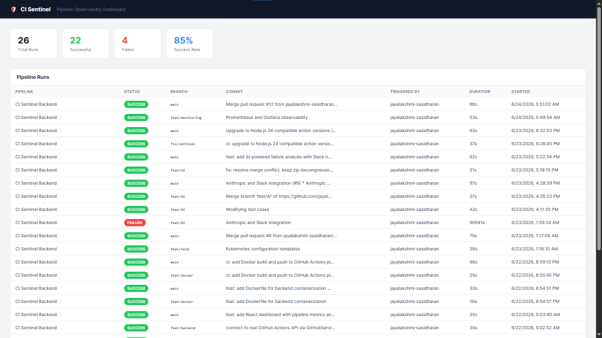
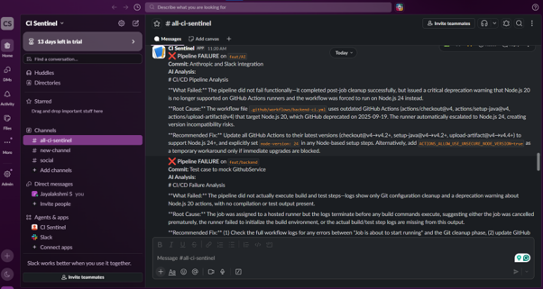
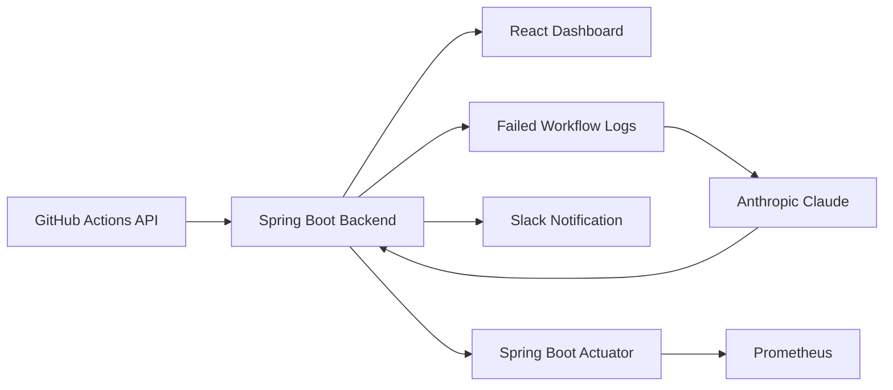

# CI Sentinel 🛡️

**AI-assisted CI/CD monitoring that turns failed build logs into actionable Slack alerts.**

CI Sentinel is a full-stack developer productivity tool that monitors GitHub Actions workflows, visualizes pipeline health, analyzes failed workflow logs using Anthropic Claude, and sends concise failure summaries to Slack.

The project combines my experience in CI/CD automation and developer tooling with Java, Spring Boot, React, AI integration, containerization, Kubernetes, and observability.


---

## The Problem

When a CI pipeline fails, engineers often have to open the workflow run, search through hundreds of lines of logs, identify the relevant error, and determine what caused it before they can begin fixing the problem.

CI Sentinel reduces that friction by automatically retrieving failed workflow logs, using AI to summarize the failure, and delivering the result directly to Slack.

---

## Features

* Monitors workflow runs from the GitHub Actions API
* Displays pipeline health through a React dashboard
* Shows successful, failed, cancelled, and in-progress workflow runs
* Calculates pipeline statistics and success rates
* Automatically detects newly failed workflow runs
* Downloads and extracts GitHub Actions logs
* Uses Anthropic Claude to:

  * Explain what failed
  * Identify the likely root cause
  * Suggest possible next steps
* Sends failure summaries to Slack through an incoming webhook
* Supports manual analysis of a selected workflow run
* Exposes application health through Spring Boot Actuator
* Exposes Prometheus-compatible application metrics
* Builds and tests the backend using GitHub Actions
* Packages and publishes the backend as a Docker image
* Includes Helm templates for Kubernetes deployment
* Includes a Jenkins pipeline as a migration reference

---

## Screenshots

### Pipeline Dashboard

The dashboard provides a high-level view of workflow health along with details about individual pipeline runs.



### AI-Generated Slack Alert

When a pipeline fails, CI Sentinel analyzes the workflow logs and sends a concise explanation to Slack.



---

## Architecture



### Failure Analysis Flow

1. CI Sentinel retrieves workflow runs from the GitHub Actions API.
2. The React dashboard displays pipeline status and health statistics.
3. A scheduled monitor checks for newly failed workflow runs.
4. The backend downloads and extracts the failed workflow’s logs.
5. A relevant log excerpt is sent to Anthropic Claude.
6. Claude generates a structured failure analysis.
7. CI Sentinel sends the analysis to the configured Slack channel.
8. The workflow run is marked as processed for the current application session.

---

## Tech Stack

### Backend

* Java 21
* Spring Boot 3.5
* Spring WebFlux `WebClient`
* Spring Boot Actuator
* Micrometer Prometheus Registry
* Maven
* Lombok
* JUnit
* Mockito

### Frontend

* React
* JavaScript
* HTML
* CSS

### CI/CD and Developer Tooling

* GitHub Actions
* Jenkins
* Maven
* Docker

### AI and Integrations

* Anthropic Claude API
* GitHub Actions REST API
* Slack Incoming Webhooks

### Deployment and Observability

* Kubernetes
* Helm
* Spring Boot Actuator
* Prometheus

---

## Project Structure

```text
ci-sentinel/
├── backend/
│   ├── src/
│   │   ├── main/
│   │   │   ├── java/
│   │   │   │   └── com/cisentinel/backend/
│   │   │   │       ├── controller/
│   │   │   │       ├── model/
│   │   │   │       ├── scheduler/
│   │   │   │       └── service/
│   │   │   └── resources/
│   │   └── test/
│   ├── Dockerfile
│   ├── pom.xml
│   └── servicemonitor.yaml
├── frontend/
│   ├── public/
│   ├── src/
│   └── package.json
├── helm/
│   └── ci-sentinel-backend/
├── docs/
│   └── images/
├── .github/
│   └── workflows/
│       └── backend-ci.yml
├── Jenkinsfile
└── README.md
```

---

## Getting Started

### Prerequisites

Install the following tools before running CI Sentinel locally:

* Java 21 or later
* Maven 3.9 or later
* Node.js 22 or later
* npm
* Git

You will also need:

* A GitHub personal access token
* An Anthropic API key
* A Slack incoming webhook URL

---

## Clone the Repository

```bash
git clone https://github.com/jayalakshmi-sasidharan/ci-sentinel.git
cd ci-sentinel
```

---

## Environment Configuration

Create a file named `.env` inside the `backend` directory:

```text
ci-sentinel/
└── backend/
    └── .env
```

Add the following variables:

```env
GITHUB_TOKEN=your_github_personal_access_token
GITHUB_OWNER=jayalakshmi-sasidharan
GITHUB_REPO=ci-sentinel
ANTHROPIC_API_KEY=your_anthropic_api_key
SLACK_WEBHOOK_URL=your_slack_incoming_webhook_url
```

### Environment Variable Reference

| Variable            | Description                                          |
| ------------------- | ---------------------------------------------------- |
| `GITHUB_TOKEN`      | GitHub token used to retrieve workflow runs and logs |
| `GITHUB_OWNER`      | Owner of the repository being monitored              |
| `GITHUB_REPO`       | Name of the repository being monitored               |
| `ANTHROPIC_API_KEY` | API key used for Claude failure analysis             |
| `SLACK_WEBHOOK_URL` | Incoming webhook used to send Slack notifications    |

For a fine-grained GitHub token, grant access only to the repository being monitored and provide read access to GitHub Actions.

> Never commit `.env`, API keys, GitHub tokens, or Slack webhook URLs to source control.


---

## Run the Backend

From the project root:

```bash
cd backend
mvn spring-boot:run
```

The backend starts at:

```text
http://localhost:8080
```

Verify that it is running:

```text
http://localhost:8080/api/pipelines/health
```

Expected response:

```text
CI Sentinel backend is running
```

---

## Run the Frontend

Open another terminal:

```bash
cd frontend
npm install
npm start
```

The React dashboard starts at:

```text
http://localhost:3000
```

The frontend retrieves pipeline information from the Spring Boot backend running on port `8080`.

---

## API Endpoints

| Method | Endpoint                      | Description                                                                        |
| ------ | ----------------------------- | ---------------------------------------------------------------------------------- |
| `GET`  | `/api/pipelines`              | Returns workflow runs from the configured GitHub repository                        |
| `GET`  | `/api/pipelines/{id}/analyze` | Retrieves the selected run’s logs, generates an AI analysis, and sends it to Slack |
| `GET`  | `/api/pipelines/health`       | Returns a basic CI Sentinel health response                                        |
| `GET`  | `/actuator/health`            | Returns the Spring Boot Actuator health status                                     |
| `GET`  | `/actuator/prometheus`        | Returns Prometheus-compatible application metrics                                  |

### Manually Analyze a Failed Workflow

First, retrieve the available pipeline runs:

```bash
curl http://localhost:8080/api/pipelines
```

Then use the ID of a failed workflow:

```bash
curl http://localhost:8080/api/pipelines/WORKFLOW_RUN_ID/analyze
```

The backend will:

1. Retrieve the selected workflow run.
2. Download its logs from GitHub.
3. Send a log excerpt to Anthropic Claude.
4. Generate a failure explanation.
5. Post the result to Slack.
6. Return the generated analysis in the API response.

---

## Example AI Analysis

CI Sentinel asks Claude to organize the result around three practical questions:

```text
1. What failed?
2. What is the likely root cause?
3. What can the engineer try next?
```

An example Slack message may look like:

```text
❌ Pipeline FAILURE on `feature/backend`

Commit: Update Maven test configuration

AI Analysis:

1. What failed:
   The Maven test stage failed while running the backend unit tests.

2. Likely root cause:
   A mocked service returned an unexpected response, causing the controller
   assertion to fail.

3. Suggested next step:
   Review the failed test output and verify that the mocked response matches
   the controller's expected PipelineRun structure.
```

The exact analysis depends on the workflow logs returned by GitHub Actions.

---

## Automated Failure Monitoring

CI Sentinel includes a scheduled monitor that checks for failed workflow runs every five minutes.

For each newly detected failure, it:

* Retrieves the workflow logs
* Generates an AI analysis
* Sends the result to Slack
* Stores the workflow ID in memory to avoid sending the same notification repeatedly during the current application session

Because processed workflow IDs are currently stored in memory, the tracking state resets when the backend restarts.

---

## Running Tests

Run all backend tests with:

```bash
cd backend
mvn test
```

The GitHub Actions workflow also runs the backend tests automatically for supported pushes and pull requests.

---

## CI/CD Pipeline

The repository demonstrates a transition from a Jenkins-based build pipeline to GitHub Actions.

### Jenkins

The `Jenkinsfile` represents the original pipeline structure:

```text
Checkout → Build → Test → Package
```

### GitHub Actions

The workflow in `.github/workflows/backend-ci.yml` performs:

```text
Checkout
   ↓
Configure Java
   ↓
Compile
   ↓
Run Tests
   ↓
Package JAR
   ↓
Upload Test Results and Artifacts
   ↓
Build Docker Image
   ↓
Publish Docker Image
```

The workflow is configured to run for changes pushed to the supported branch and for pull requests.

Docker publishing occurs only under the conditions configured in the GitHub Actions workflow.

---

## Docker

Build the backend application:

```bash
cd backend
mvn clean package
```

Build the Docker image:

```bash
docker build -t ci-sentinel-backend .
```

Run the container with the required environment variables:

```bash
docker run \
  -p 8080:8080 \
  -e GITHUB_TOKEN=your_github_token \
  -e GITHUB_OWNER=jayalakshmi-sasidharan \
  -e GITHUB_REPO=ci-sentinel \
  -e ANTHROPIC_API_KEY=your_anthropic_api_key \
  -e SLACK_WEBHOOK_URL=your_slack_webhook_url \
  ci-sentinel-backend
```

For local use, prefer an environment file rather than placing secrets directly in terminal history:

```bash
docker run --env-file .env -p 8080:8080 ci-sentinel-backend
```

---

## Kubernetes and Helm

A Helm chart is included in:

```text
helm/ci-sentinel-backend
```

The chart contains Kubernetes resources for deploying the Spring Boot backend, including:

* Deployment configuration
* Kubernetes Service
* Health probes
* Environment variables sourced from a Kubernetes Secret
* Configurable Docker image settings

Create the required Kubernetes Secret before installing the chart:

```bash
kubectl create secret generic ci-sentinel-secrets \
  --from-literal=GITHUB_TOKEN=your_github_token \
  --from-literal=GITHUB_OWNER=jayalakshmi-sasidharan \
  --from-literal=GITHUB_REPO=ci-sentinel \
  --from-literal=ANTHROPIC_API_KEY=your_anthropic_api_key \
  --from-literal=SLACK_WEBHOOK_URL=your_slack_webhook_url
```

Install the Helm chart:

```bash
helm install ci-sentinel ./helm/ci-sentinel-backend
```

Check the deployed resources:

```bash
kubectl get pods
kubectl get services
```

The repository includes Kubernetes and Helm configuration, but production readiness depends on the target cluster, secret-management approach, networking configuration, and operational requirements.

---

## Observability

CI Sentinel uses Spring Boot Actuator and Micrometer to expose health information and Prometheus-compatible metrics.

### Health Endpoint

```text
http://localhost:8080/actuator/health
```

### Prometheus Metrics

```text
http://localhost:8080/actuator/prometheus
```

A Prometheus `ServiceMonitor` configuration is included for environments using the Prometheus Operator.

Grafana dashboards are not currently included in the repository.

---

## Security Considerations

CI Sentinel integrates with GitHub, Anthropic, and Slack, so configuration values must be handled carefully.

Recommended practices include:

* Never commit secrets to Git
* Use fine-grained GitHub tokens with minimum required permissions
* Store production secrets in a secure secret manager
* Restrict access to the backend API
* Avoid exposing the manual analysis endpoint publicly without authentication
* Review CI logs before sending them to an external AI service
* Add secret redaction for tokens, passwords, authorization headers, and connection strings
* Configure timeouts and retries for external API calls

CI Sentinel is currently intended as a portfolio and learning project, not as a production security product.

---

## Current Limitations

* Monitors one configured GitHub repository at a time
* Stores processed workflow IDs only in application memory
* Resets notification history when the backend restarts
* Does not currently include authentication or authorization
* Does not yet sanitize every possible type of secret from CI logs
* Depends on external GitHub, Anthropic, and Slack services
* The frontend currently expects the backend to run locally on port `8080`
* The dashboard does not yet provide automatic refresh, pagination, or advanced filtering
* Helm configuration is included, but large-scale or multi-replica deployment has not been validated
* Grafana dashboards and Terraform infrastructure are not currently included

---

## Roadmap

### Completed

* [x] Spring Boot REST API
* [x] GitHub Actions workflow integration
* [x] Pipeline run data model
* [x] React pipeline dashboard
* [x] Pipeline health statistics
* [x] Automatic failure detection
* [x] Failed workflow log retrieval
* [x] Anthropic Claude failure analysis
* [x] Slack failure notifications
* [x] Manual failure-analysis endpoint
* [x] JUnit and controller tests
* [x] Jenkins pipeline
* [x] GitHub Actions CI workflow
* [x] Docker image build and publishing
* [x] Helm deployment templates
* [x] Spring Boot Actuator health checks
* [x] Prometheus metrics endpoint
* [x] Prometheus `ServiceMonitor` configuration

### Planned

* [ ] Change the manual analysis operation from `GET` to `POST`
* [ ] Add persistent pipeline and notification history
* [ ] Prevent duplicate notifications across restarts and multiple replicas
* [ ] Add authentication and authorization
* [ ] Add comprehensive CI-log secret redaction
* [ ] Support multiple repositories and organizations
* [ ] Add configurable repository and branch filters
* [ ] Add dashboard auto-refresh and manual refresh controls
* [ ] Add direct links to GitHub workflow runs
* [ ] Display AI analysis inside the dashboard
* [ ] Add external API retry, timeout, and rate-limit handling
* [ ] Expand unit and integration test coverage
* [ ] Add resource limits and additional Kubernetes security settings
* [ ] Add Grafana dashboards
* [ ] Add optional Terraform infrastructure

---

## Why I Built CI Sentinel

My professional experience has largely been in Jenkins, CI/CD pipelines, release automation, and internal developer tooling.

While exploring whether my next step should be in software engineering, build and release engineering, platform engineering, or DevOps, I realized that the part I consistently enjoy is building tools that make engineers more productive.

CI Sentinel gave me an opportunity to bring those areas together.

It allowed me to use my existing experience with Java, Jenkins, and CI/CD automation while gaining more hands-on experience with React, GitHub Actions APIs, AI integration, Slack automation, Docker, Kubernetes, Helm, and application observability.

The goal was not just to build another pipeline dashboard. It was to explore how CI/CD tools could provide engineers with more useful context when something fails.

---

## Future Direction

The longer-term goal is to develop CI Sentinel into a broader developer productivity platform that can:

* Monitor multiple repositories
* Retain pipeline and failure history
* Detect recurring failure patterns
* Correlate failures with commits and deployment changes
* Provide team-level pipeline reliability metrics
* Deliver secure and context-aware AI analysis
* Integrate with additional CI/CD and communication platforms

---

## Author

**Jayalakshmi Sasidharan**

* GitHub: [jayalakshmi-sasidharan](https://github.com/jayalakshmi-sasidharan)
* LinkedIn: [jayalakshmi-sasidharan](https://www.linkedin.com/in/jayalakshmi-sasidharan/)

---

## License

This project is currently provided for portfolio and educational purposes.

Add a license file before allowing reuse, modification, or redistribution under a specific open-source license.
